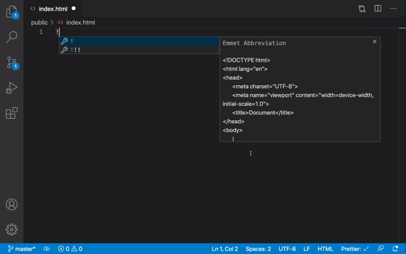

# Build Websites X10 Times Faster By using vsCode & Emmet 💻🚀

📕 Please read the [Contribution-Guidelines](contribution.md)

### Table of Content
- [01. Insatall Emmet Plugin to vsCode ⚙️](#install) 
- [02. Let's start speed up coding 🚀](#start) 
  - [a. Shorthand for child elements](#a) 
  - [b. Shorthand for sibling](#b) 
  - [c. Grouping  shorthand](#c) 
  - [d. Numbering shorthand](#d) 
  - [e. Text shorthand](#e) 
  - [f. Using ID](#f) 
  - [g. Using Classes](#g)  

## 01. Insatall Emmet Plugin to vsCode ⚙️<a name="install"/>
Emmet is a plugin for Visual Studio Code text editor that provides a number of tools to help you quickly write HTML and CSS code. Open your vsCode then go to extensions and search Emmet. Install this plugin to your vsCode.  
   

## 02. Let's start speed up coding 🚀<a name="start"/>
Emmet is increases your productivity to a great extent so you don’t have to type the same repetitive code again and again. We just have to type the abbreviation and press the TAB KEY/ ENTER KEY and emmet will convert it to the corresponding code. **To get the basic structure of HTML page you type ! and press TAB KEY/ ENTER KEY.**  
   

### a. Shorthand for child elements<a name="a"/>
Emmet is increases your productivity to a great extent so you don’t have to type the same repetitive code again and again. We just have to type the abbreviation and press the TAB KEY/ ENTER KEY and emmet will convert it to the corresponding code. **To get the basic structure of HTML page you type ! and press TAB KEY/ ENTER KEY.**  
   

### b. Shorthand for sibling<a name="b"/>
Emmet is increases your productivity to a great extent so you don’t have to type the same repetitive code again and again. We just have to type the abbreviation and press the TAB KEY/ ENTER KEY and emmet will convert it to the corresponding code. **To get the basic structure of HTML page you type ! and press TAB KEY/ ENTER KEY.**  
   

### c. Grouping  shorthand<a name="c"/>
Emmet is increases your productivity to a great extent so you don’t have to type the same repetitive code again and again. We just have to type the abbreviation and press the TAB KEY/ ENTER KEY and emmet will convert it to the corresponding code. **To get the basic structure of HTML page you type ! and press TAB KEY/ ENTER KEY.**  
   

### d. Numbering shorthand<a name="d"/>
Emmet is increases your productivity to a great extent so you don’t have to type the same repetitive code again and again. We just have to type the abbreviation and press the TAB KEY/ ENTER KEY and emmet will convert it to the corresponding code. **To get the basic structure of HTML page you type ! and press TAB KEY/ ENTER KEY.**  
   

### e. Text shorthand<a name="e"/>
Emmet is increases your productivity to a great extent so you don’t have to type the same repetitive code again and again. We just have to type the abbreviation and press the TAB KEY/ ENTER KEY and emmet will convert it to the corresponding code. **To get the basic structure of HTML page you type ! and press TAB KEY/ ENTER KEY.**  
   

### f. Using ID<a name="f"/>
Emmet is increases your productivity to a great extent so you don’t have to type the same repetitive code again and again. We just have to type the abbreviation and press the TAB KEY/ ENTER KEY and emmet will convert it to the corresponding code. **To get the basic structure of HTML page you type ! and press TAB KEY/ ENTER KEY.**  
   

### g. Using Classes<a name="g"/>
Emmet is increases your productivity to a great extent so you don’t have to type the same repetitive code again and again. We just have to type the abbreviation and press the TAB KEY/ ENTER KEY and emmet will convert it to the corresponding code. **To get the basic structure of HTML page you type ! and press TAB KEY/ ENTER KEY.**  
   

