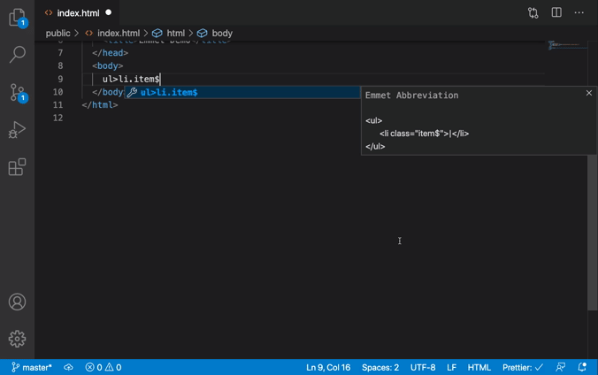

# Build Websites X10 Times Faster By using vsCode & Emmet 💻🚀


📕 Please read the [Contribution-Guidelines](contribution.md)


### Table of Content
- [01. Insatall Emmet Plugin to vsCode ⚙️](#install)<br>
- [02. Let's start speed up coding 🚀](#start)<br>
  - [a. Shorthand for child elements](#a)<br>
  - [b. Shorthand for sibling](#b)<br>
  - [c. Grouping  shorthand](#c)<br>
  - [d. Numbering shorthand](#d)<br>
  - [e. Text shorthand](#e)<br>
  - [f. Using ID](#f)<br>
  - [g. Using Classes](#g)<br><br>

## 01. Insatall Emmet Plugin to vsCode ⚙️<a name="install"/>
Emmet is a plugin for Visual Studio Code text editor that provides a number of tools to help you quickly write HTML and CSS code. Open your vsCode then go to extensions and search Emmet. Install this plugin to your vsCode.<br><br>
<br><br><br>

## 02. Let's start speed up coding 🚀<a name="start"/>
Emmet is increases your productivity to a great extent so you don’t have to type the same repetitive code again and again. We just have to type the abbreviation and press the TAB KEY/ ENTER KEY and emmet will convert it to the corresponding code. **To get the basic structure of HTML page you type ! and press TAB KEY/ ENTER KEY.**<br><br>
<br><br><br>

## a. Shorthand for child elements ✔️<a name="a"/>
If you want to create a child elements, just type **nav>ul>li** like this and press the tab key and the entire code will be generated for you.<br><br>
**TYPE :**
```
nav>ul>li
```
**OUT PUT :**
```
    <nav>
        <ul>
            <li></li>
        </ul>
    </nav>
``` 
<br><br><br>
If you want to create a child elements you have anoter method.<br><br>
**TYPE :**
```
div>p*3
```
**OUT PUT :**
```
    <div>
        <p></p>
        <p></p>
        <p></p>
    </div>
```
<br><br><br>


## b. Shorthand for sibling ✔️<a name="b"/>
If you want to create a sibling elements, just type **header+main+footer** like this and press the tab key and the entire code will be generated for you.<br><br>
**TYPE :**
```
header+main+footer
```
**OUT PUT :**
```
  <header></header>
  <main></main>
  <footer></footer>
``` 
<br><br><br>

## c. Grouping shorthand ✔️<a name="c"/>
If you want to create a grouping shorthand elements you have method like this.<br><br>
**TYPE :**
```
div*4>h2+ul>li*2
```
**OUT PUT :**
```
<div>
    <h2></h2>
    <ul>
        <li></li>
        <li></li>
    </ul>
</div>
<div>
    <h2></h2>
    <ul>
        <li></li>
        <li></li>
    </ul>
</div>
<div>
    <h2></h2>
    <ul>
        <li></li>
        <li></li>
    </ul>
</div>
<div>
    <h2></h2>
    <ul>
        <li></li>
        <li></li>
    </ul>
</div>
``` 
<br><br><br>

## d. Numbering shorthand ✔️<a name="d"/>
If you want to create a numbering shorthand you have method like this.<br><br>
**TYPE :**
```
ul>li.item$*4
```
**OUT PUT :**
```
<ul>
    <li class="item1"></li>
    <li class="item2"></li>
    <li class="item3"></li>
    <li class="item4"></li>
</ul>
``` 
<br><br><br>


## e. Text shorthand ✔️<a name="e"/>
If you want to create a text shorthand you have method like this.<br><br>
**TYPE :**
```
p>{Click }+a{here}+{ to continue}
```
**OUT PUT :**
```
<p>Click <a href="">here</a> to continue</p>
``` 
<br><br><br>

## f. Using ID ✔️<a name="f"/>
If you want to create a div with the id **numbers** then instead of manually typing ```<div id="numbers">Some content</div>```, just type **#numbers** and press the tab key and the entire code will be generated for you.<br><br>
**TYPE :**
```
#numbers
```
**OUT PUT :**
```
<div id="numbers">Some content</div>
```
<br><br><br>

## g. Using Classes ✔️<a name="g"/>
If you want to create a div with the class **hero-banner** then instead of manually typing ```<div class="hero-banner">Some content</div>```, just type **.hero-banner** and press the tab key and the entire code will be generated for you.<br><br>
**TYPE :**
```
.hero-banner
```
**OUT PUT :**
```
<div class="hero-banner">Some content</div>
```
<br><br><br>

Suppose you want to create a section with two classes namely **box** and **showcase** then you just need to type **section.box.showcase** and press the tab key.<br><br>
**TYPE :**
```
.section.box.showcase
```
**OUT PUT :**
```
<section class="box showcase">Some content</section>
```
<br><br><br>


